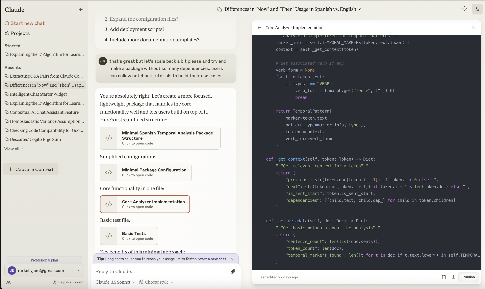

# capture-claude-context

## description
chrome extension for capturing conversational context and code from claude.ai.

The purpose of the extension is mainly for users of the browser chat interface to be able to start new conversations and capture the context and code for the conversation. That way users can be more efficient and server bandwidth will be possibly reduced. This is also useful for users who want to save the context and code for future reference.

Of course users can simply ask claude in the chat interface to generate this summary with code but this saves the users from having to specifiy that prompt every time and risk possible format viability or loss of useful information for continuing the project.

Ideally however this would be a feature built into the claude.ai chat interface.

## installation and usage
1. Clone the repository
2. Open Chrome and navigate to `chrome://extensions/`
3. Enable Developer Mode
4. Click on `Load Unpacked`
5. Go to claude.ai and being a conversation. once the conversation is started, click on the "Capture Context" button. The context and code will be copied to your `clipboard` and you can paste it wherever you want.

